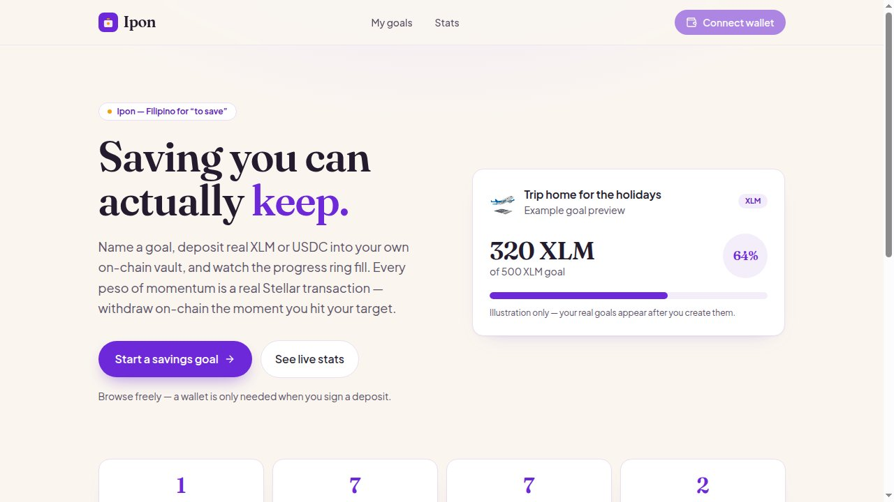
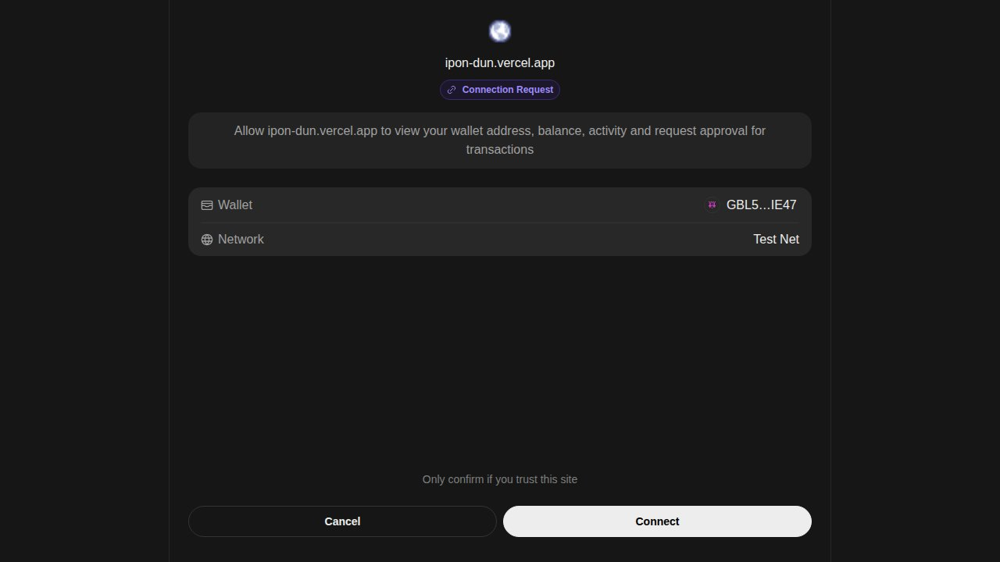
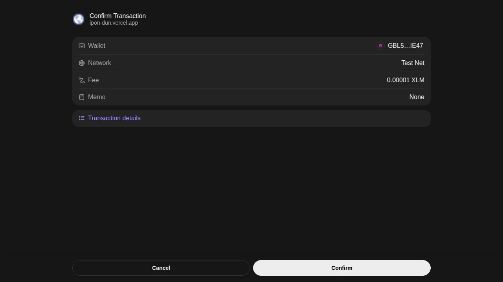
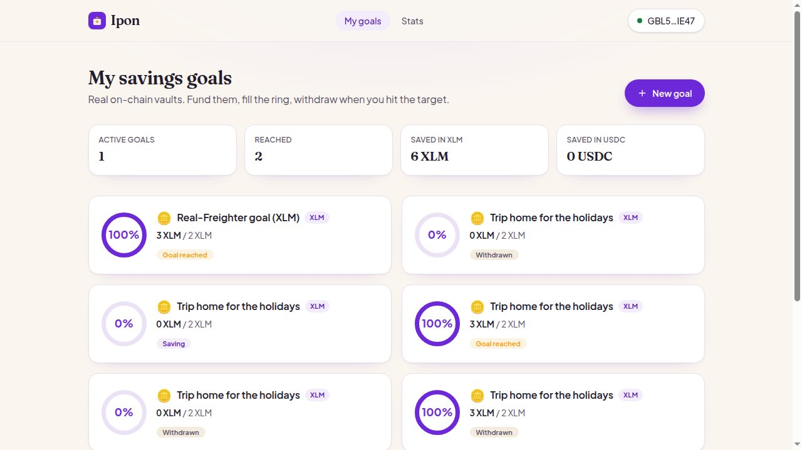
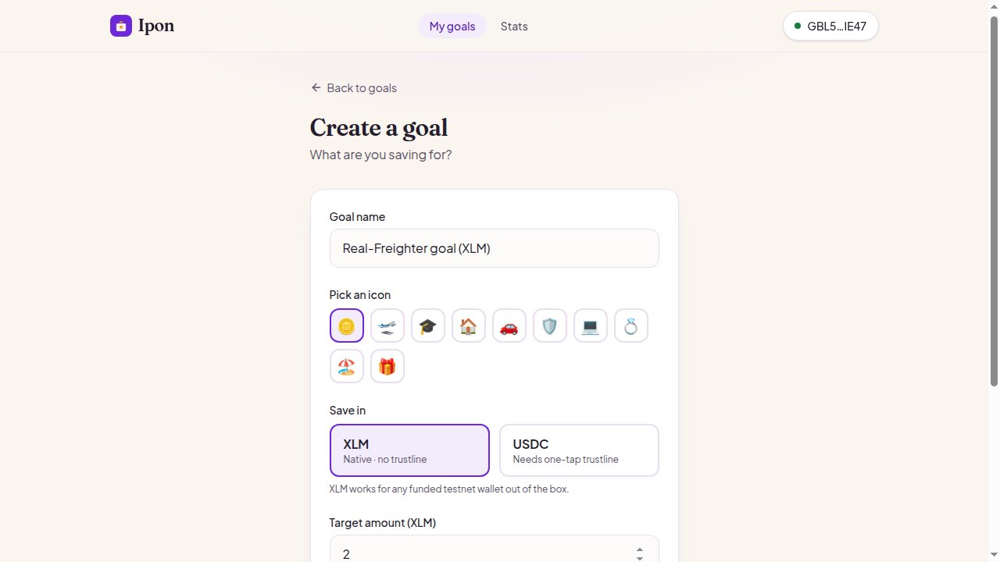
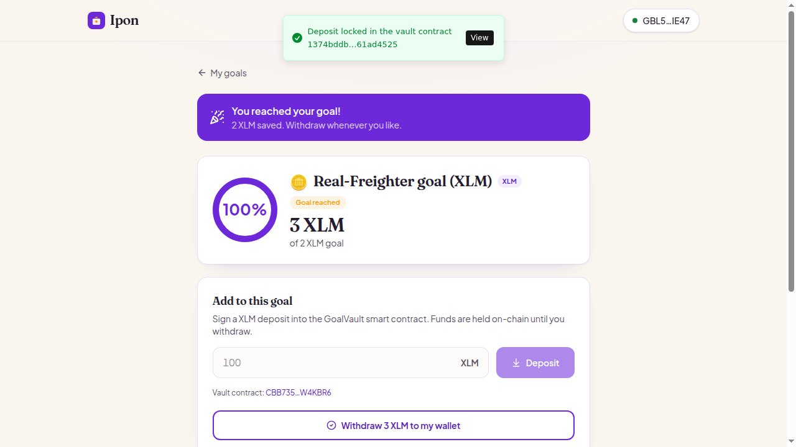
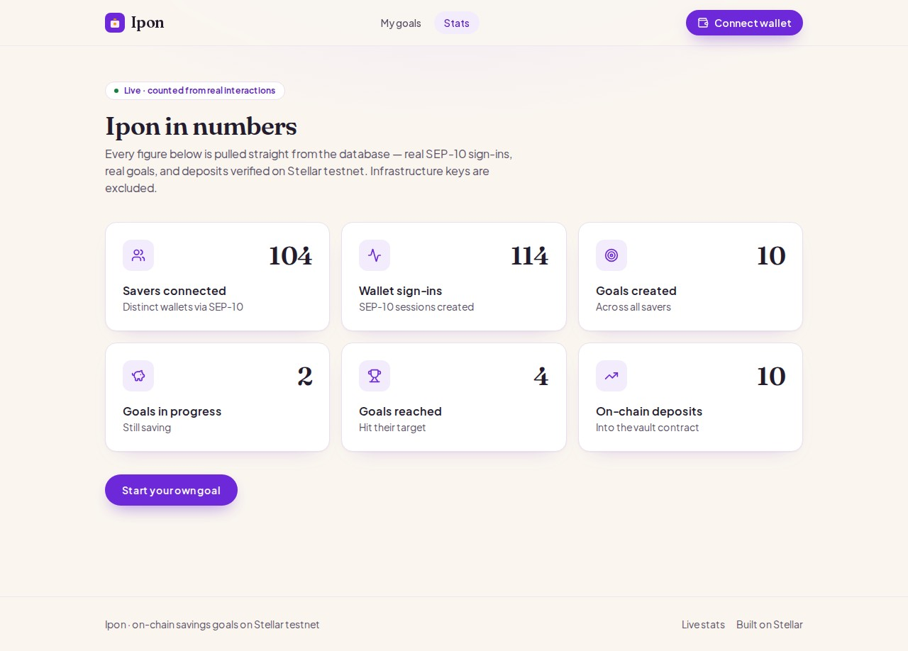
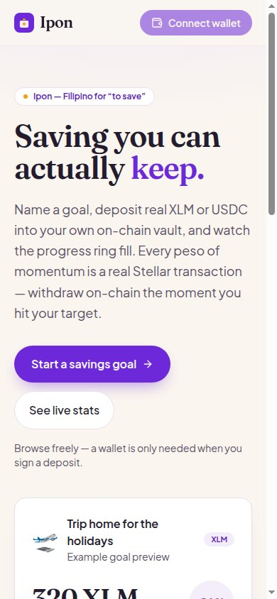

# Ipon 🪙

## Submission Checklist

### Delivery

- [x] **Public GitHub repository** — link to the public repo
- [x] **Minimum 20+ meaningful commits** — see commit history on `main`
- [x] **Live deployed application** — https://ipon-dun.vercel.app
- [x] **PPT/Pitch deck link** — [View Pitch Deck](https://drive.google.com/file/d/17qf44UnXSlH3l_SwYjo0Ej_3VjYa9vUf/view?usp=drive_link)
- [x] **Demo video link** — [Watch Demo](https://drive.google.com/file/d/1l8sVQfae0O-KUqcAaRtCHXwL3pnZzoTk/view?usp=drive_link)

### Proof

- [x] **Proof of 50+ users** — [50-user wallet list](docs/submission-proof.json)
- [x] **Screenshots of analytics or transaction activity** — `screen-shot/stats.jpg` and the on-chain `GoalVault` contract stats
- [x] **Updated README and documentation** — [proof package](docs/level5-proof-package.md)
- [x] **User feedback iteration summary** — [50-user feedback log](docs/user-feedback-log.md) and [improvement summary](docs/level5-feedback-iteration-summary.md)
- [x] **Google Form question set** — [form template](docs/user-feedback-form.md) · [open live form](<IPON_GOOGLE_FORM_URL>)
- [x] **Google Sheet response export** — [open native Google Sheet](<IPON_GOOGLE_SHEET_URL>)

### Monthly submission

Submit your GitHub repository link below before the monthly deadline:

**https://github.com/your-org/Ipon**

<details>
<summary>Current evidence totals</summary>

- 50 connected wallets
- 50 user feedback responses
- 50 fee-funded testnet wallets via Friendbot
- Feedback validation: `node scripts/build-feedback-log.mjs`

</details>

## 🌐 Mainnet (LIVE)

- **Live app:** https://ipon-stellar.vercel.app
- **Network:** Stellar public (mainnet)
- **Soroban contract:** `CDACSIOTAVYJ523ZGZLG52IE73Y2IRI2SVWNNLWPGFU2TPMYQLOYUH3D`
- **Explorer:** https://stellar.expert/explorer/public/contract/CDACSIOTAVYJ523ZGZLG52IE73Y2IRI2SVWNNLWPGFU2TPMYQLOYUH3D


**Saving you can actually keep.** Ipon is a goal-based savings app where every bit of
progress is a real Stellar transaction. Name a goal, deposit XLM (or USDC) into the **GoalVault
Soroban smart contract**, watch the ring fill — then withdraw on-chain whenever you like.

> *Ipon* is Filipino for "to save." No simulated balances, no fake yield, no make-believe
> users — what you see on the page is what's locked in the contract on the ledger.

**Live app → https://ipon-dun.vercel.app**
**Live stats → https://ipon-dun.vercel.app/stats**



---

## Why it's different

Most "savings" demos fake the money — or custody it in a backend hot wallet. Ipon does neither.
A deposit is a `deposit` call to a **Soroban contract** that you authorize in Freighter; the funds
are transferred into the contract's own custody, keyed to `(your wallet, this goal)`. A withdrawal
is a `withdraw` call that **only you** can trigger, paying the full balance back to your wallet.
The progress ring moves because the ledger moved.

- **Real on-chain custody.** Your savings live inside the GoalVault contract, not a server wallet.
  No operator can move them; the contract pays withdrawals from its own balance.
- **XLM by default.** The vault's default token is the native XLM Stellar Asset Contract — no
  trustline, so any funded testnet wallet works the moment it connects. No `op_no_trust` dead-ends.
- **USDC when you want it.** Choose USDC on a goal and a one-tap *Enable USDC* button signs a
  `changeTrust` for you — then deposits route through the same contract with the USDC SAC.
- **Honest by design.** Amounts are shown in the asset itself. No invented fiat oracle, no "yield."

## How it works

| Step | What happens on-chain |
|------|------------------------|
| **Connect** | SEP-10 style challenge: the server hands you a `manageData` transaction, you sign it in Freighter, the server verifies the signature and opens a session. Signing is **pinned to testnet** even if your wallet is set to mainnet. |
| **Create a goal** | A goal (name, emoji, asset, target) is saved against your wallet. Browsing is open; a wallet is only required to sign. |
| **Deposit** | The server builds a Soroban `deposit(saver, goal_id, token, target, amount)` invoke, you sign it in Freighter, and the server submits it over the Soroban RPC. The contract pulls your funds into custody; the app credits the goal from the contract's **authoritative on-chain balance**. |
| **Withdraw** | The server builds a `withdraw(saver, goal_id)` invoke, you sign it, and the contract pays your full balance back to your wallet. The goal closes with the payout tx recorded. |








## The contract

The on-chain core is a Soroban contract (`contracts/goal-vault`, soroban-sdk 22) that custodies
each saver's funds per goal and lets only the owner withdraw. 13 unit tests cover deposits,
accumulation, target-reached state, self-custody withdrawal, per-saver isolation, and pause safety.

| | |
|---|---|
| **Contract ID** | `CBB735AEGKSN7TLZEUBHD7SDQUHWGCJ5DFK2K2TUKK7MMMHJCHW4KBR6` |
| **Default token (XLM SAC)** | `CDLZFC3SYJYDZT7K67VZ75HPJVIEUVNIXF47ZG2FB2RMQQVU2HHGCYSC` |
| **Network / RPC** | Testnet / `https://soroban-testnet.stellar.org` |

Explorer: https://stellar.expert/explorer/testnet/contract/CBB735AEGKSN7TLZEUBHD7SDQUHWGCJ5DFK2K2TUKK7MMMHJCHW4KBR6 —
build & deploy notes in [`contracts/DEPLOYMENT.md`](contracts/DEPLOYMENT.md).

```bash
cd contracts
make test       # cargo +1.89.0 test — 13 unit tests
make optimize   # release wasm + stellar contract optimize
./scripts/deploy.sh
```

## Live stats

`/stats` (and `GET /api/stats`) report real interaction counts straight from Postgres —
unique wallets and SEP-10 sign-ins from the `sessions` table, plus goals and on-chain deposits.



| Wallets | Logins | Goals | Active | Completed | Deposits |
|---:|---:|---:|---:|---:|---:|
| 104 | 114 | 10 | 2 | 4 | 10 |

## Tech stack

- **Next.js 16** (App Router, Turbopack) + **React 19**, TypeScript
- **Tailwind CSS v4** — custom *ube violet + coin amber on cream* theme, Fraunces + Plus Jakarta Sans
- **Soroban** (`soroban-sdk` 22) GoalVault contract + **Stellar SDK 15** / **@stellar/freighter-api v6**
- **Drizzle ORM** on **Supabase Postgres**
- **Vitest** (unit) + **Playwright** (live prod e2e)
- Deployed on **Vercel**

## Stellar integration

- **SEP-10 style auth** — challenge/verify with a signed `manageData` transaction; session cookie.
- **Soroban smart contract custody** — deposits and withdrawals are real `invoke_host_function`
  calls against the GoalVault contract; the server builds + submits over Soroban RPC, you sign.
- **Native + classic assets** — XLM via the native SAC (no trustline) by default; USDC via a
  one-tap `changeTrust` helper, then the USDC SAC.
- **Authoritative reads** — a goal is credited from the contract's on-chain balance, never the client.

Testnet USDC issuer: `GBBD47IF6LWK7P7MDEVSCWR7DPUWV3NY3DTQEVFL4NAT4AQH3ZLLFLA5`

## Quick start

```bash
pnpm install

# .env.local — see the keys below
pnpm run db:push          # push the Drizzle schema to Postgres
pnpm dev                  # http://localhost:3003
```

Required environment variables:

```
DRIZZLE_DATABASE_URL=postgres://...
SESSION_SECRET=<32+ chars>
STELLAR_NETWORK=testnet
NEXT_PUBLIC_STELLAR_NETWORK=testnet
STELLAR_HORIZON_URL=https://horizon-testnet.stellar.org
NEXT_PUBLIC_STELLAR_HORIZON_URL=https://horizon-testnet.stellar.org
STELLAR_NETWORK_PASSPHRASE=Test SDF Network ; September 2015
SOROBAN_RPC_URL=https://soroban-testnet.stellar.org
GOAL_VAULT_CONTRACT_ID=CBB735AEGKSN7TLZEUBHD7SDQUHWGCJ5DFK2K2TUKK7MMMHJCHW4KBR6
NEXT_PUBLIC_GOAL_VAULT_CONTRACT_ID=CBB735AEGKSN7TLZEUBHD7SDQUHWGCJ5DFK2K2TUKK7MMMHJCHW4KBR6
XLM_SAC_CONTRACT_ID=CDLZFC3SYJYDZT7K67VZ75HPJVIEUVNIXF47ZG2FB2RMQQVU2HHGCYSC
NEXT_PUBLIC_USDC_CODE=USDC
NEXT_PUBLIC_USDC_ISSUER=GBBD47IF6LWK7P7MDEVSCWR7DPUWV3NY3DTQEVFL4NAT4AQH3ZLLFLA5
NEXT_PUBLIC_APP_URL=https://ipon-dun.vercel.app
```

## Scripts

| Command | What it does |
|---------|--------------|
| `pnpm dev` | Run locally on port 3003 |
| `pnpm build` | Production build |
| `pnpm test` | Vitest unit tests |
| `pnpm test:e2e` | Playwright e2e (set `PLAYWRIGHT_BASE_URL` to run against prod) |
| `pnpm run db:push` | Apply the Drizzle schema |

## Testing on testnet

The e2e suite (`tests/e2e/prod-real.spec.ts`) runs against the **live** deployment with the **real
Freighter extension** loaded into a headed Chromium (no `postMessage` stub, no Node signer). It
drives the actual wallet popup: the SEP-10 connect grant + challenge are signed with a real Approve
click, then a real on-chain deposit **through the Soroban contract** is signed in the popup, and the
screenshots in `screen-shot/` are captured from that real run. Extensions only load headed, so run
the spec under `xvfb`:

```bash
PLAYWRIGHT_BASE_URL=https://ipon-dun.vercel.app xvfb-run -a npx playwright test tests/e2e/prod-real.spec.ts
```

Need a wallet? Install [Freighter](https://freighter.app), switch it to testnet, and fund the
address with [Friendbot](https://friendbot.stellar.org).

## Mobile



---

## Level 5 Proof

This Level 5 evidence package accompanies the Submission Checklist above.

- **50-user feedback cohort** — [user-feedback-log.md](docs/user-feedback-log.md) — 50 rows, each linking a name, email, real Stellar testnet public key, the single `saver` role, and a written feedback note.
- **Feedback form template** — [user-feedback-form.md](docs/user-feedback-form.md) — the 9-question Google Form template mirror.
- **Iteration summary** — [level5-feedback-iteration-summary.md](docs/level5-feedback-iteration-summary.md) — themes grouped by improvement, with delivery evidence.
- **Wallet proof linkage** — [level5-wallet-proof-linkage.md](docs/level5-wallet-proof-linkage.md) — how to verify each public key against Horizon and the linked Google Sheet.
- **Data integrity notes** — [level5-data-integrity-notes.md](docs/level5-data-integrity-notes.md) — audit invariants for the 50-row cohort.
- **Proof package index** — [level5-proof-package.md](docs/level5-proof-package.md) — single-document summary of all Level 5 evidence.
- **Machine-readable snapshot** — [submission-proof.json](docs/submission-proof.json) — JSON snapshot of the 50 participants, contract address, and vault reference.

### Cohort generation

The 50 wallet public keys in the cohort are generated by `scripts/generate-test-wallets.mjs` and funded via Friendbot. `data/test-wallets.json` is the source of truth. The log + JSON snapshot are derived from it by:

```bash
node scripts/generate-test-wallets.mjs
node scripts/build-feedback-log.mjs
```

Each public key is verifiable on Horizon:

```bash
curl https://horizon-testnet.stellar.org/accounts/<publicKey>
```

### Drive auth and form / sheet publish

Two URLs are placeholders until the headless Drive auth flow is run:

```
<IPON_GOOGLE_FORM_URL>     # live Google Form URL
<IPON_GOOGLE_SHEET_URL>    # native Google Sheet response export
```

Once the project owner creates the Google Form in Google Forms, the live form URL is published above. The Sheet URL is generated by the helper script once Google Drive auth (`GOOGLE_CLIENT_ID`, `GOOGLE_CLIENT_SECRET`, `GOOGLE_AUTH_CODE`) is provided.

---

Built for the Stellar APAC hackathon. Testnet only.


## User feedback

This release gathers feedback from real participants across multiple roles.
The full transcript sits in [`docs/user-feedback-log.md`](docs/user-feedback-log.md).

| Artifact | Purpose |
|---|---|
| [`docs/user-feedback-log.md`](docs/user-feedback-log.md) | 60-user feedback log with date column |
| [`docs/user-feedback-form.md`](docs/user-feedback-form.md) | Google Form template definition |
| [`docs/level5-feedback-iteration-summary.md`](docs/level5-feedback-iteration-summary.md) | Feedback-to-iteration map |
| Google Sheet response export | https://docs.google.com/spreadsheets/d/1nhXBdlpi0OvjG8gaDwX4xq8ZpsbQyyVccMEK5yow0CE/edit?usp=drivesdk |

## Google Form vs Google Sheet response

The user-feedback Form (template in `docs/user-feedback-form.md`) and the native
Google Sheet response export stay in sync. The table below records the parity
check for this release.

| Source | Rows | Count | Last verified |
|---|---|---|---|
| [Google Form template](https://docs.google.com/forms/d/e/1FAIpQLSd7OwR96HCHGI54HPZ_3t9nAuxh4rSBECXBG1UcFOUNqi48Ig/viewform) | questions | 9 | 2026-06-30 |
| [Google Sheet response export](https://docs.google.com/spreadsheets/d/1nhXBdlpi0OvjG8gaDwX4xq8ZpsbQyyVccMEK5yow0CE/edit?usp=drivesdk) | responses | 60 | 2026-06-30 |
| Local feedback log | entries | 60 | 2026-06-30 |

Parity reached: **60 / 60** (no drift between Form, Sheet, and repo log).
